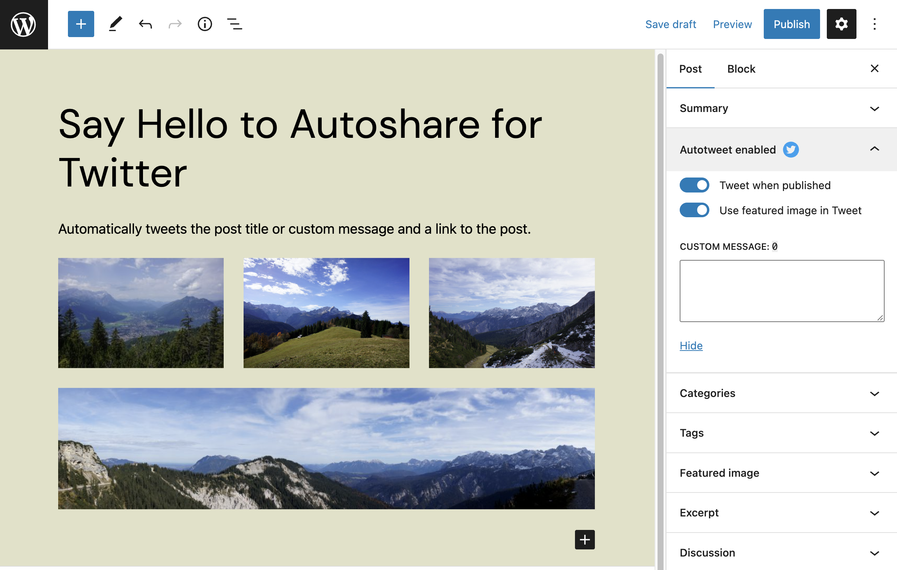
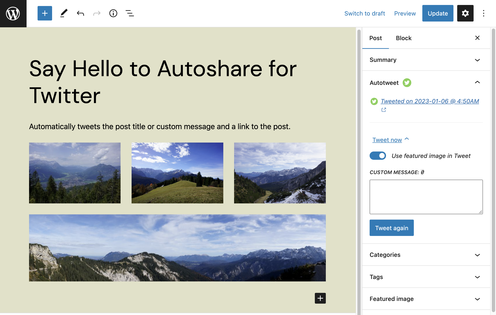

# Autoshare for Twitter

> Automatically tweets the post title or custom message and a link to the post.

[](#support-level) [](https://github.com/10up/autoshare-for-twitter/releases/latest)  [](https://github.com/10up/autoshare-for-twitter/blob/develop/LICENSE.md)
[](https://github.com/10up/autoshare-for-twitter/actions/workflows/eslint.yml)
[](https://github.com/10up/autoshare-for-twitter/actions/workflows/php-compatibility.yml)
[](https://github.com/10up/autoshare-for-twitter/actions/workflows/phpcs.yml)
[](https://github.com/10up/autoshare-for-twitter/actions/workflows/phpunit.yml)
[](https://github.com/10up/autoshare-for-twitter/actions/workflows/cypress.yml)

## Overview

**Disclaimer:** _TWITTER, TWEET, RETWEET and the Twitter logo are trademarks of Twitter, Inc. or its affiliates._

**Note:** Posts and pages are supported by default. Developers can use the `autoshare_for_twitter_default_post_types` filter to change the default supported post types (for more, see #25). The plugin namespace changed to just 'autoshare' as of version 1.0.0.

Custom post types can now be opted into autoshare features like so:

```php
function opt_my_cpt_into_autoshare() {
	add_post_type_support( 'my-cpt', 'autoshare-for-twitter' );
}
add_action( 'init', 'opt_my_cpt_into_autoshare' );
```

In addition, adding support while registering custom post types also works. Post types are automatically set to autoshare. Future versions of this plugin could allow this to be set manually.

While the autoshare feature can be opted into for post types using the above filter, by default the editor still has to manually enable autoshare during the post prepublish flow. The `autoshare_for_twitter_enabled_default` filter allows autoshare to be enabled by default for all posts of a given post type. Editors can still manually uncheck the option during the publishing flow.

Example:

```php
function enable_autoshare_by_default_for_core_post_type( $enabled, $post_type ) {
	if ( 'post' === $post_type ) {
		return true;
	}

	return $enabled;
}
add_filter( 'autoshare_for_twitter_enabled_default', 'enable_autoshare_by_default_for_core_post_type', 10, 2 );
```

## Plugin Compatibility

### Distributor

When using with 10up's [Distributor plugin](https://github.com/10up/distributor), posts that are distributed will not be autoshared if they are already tweeted from the origin site. Autoshare for Twitter tracks posts that have been tweeted in post meta to avoid "double tweeting". To avoid this behavior, use the `dt_blacklisted_meta` filter to exclude the 'autoshare_for_twitter_status' meta value from being distributed :

```php
add_filter( 'dt_blacklisted_meta', function( $blacklisted_metas ) {
	$blacklisted_metas[] = 'autoshare_for_twitter_status';
	return $blacklisted_metas;
} )
```

| Autoshare for Twitter Settings, found under `Settings` > `Autoshare for Twitter`. | 
| --------------- |
|[](.wordpress-org/screenshot-1.png)|

| Create post screen with Autoshare for Twitter options | Published post screen with Autoshare for Twitter options.
| -------------- | ----------------
| [](.wordpress-org/screenshot-2.png) | [](.wordpress-org/screenshot-3.png) |

## Requirements

- PHP 7.4+
- [WordPress](http://wordpress.org) 5.7+

## Installation

1. Install the plugin via the plugin installer, either by searching for it or uploading a .ZIP file.
2. Activate the plugin.
3. Save Twitter connection settings, found under `Settings` > `Autoshare for Twitter`.

## FAQs

### Does this plugin work with Gutenberg?

Yes, yes it does! For more details on this, see [#44](https://github.com/10up/autoshare-for-twitter/pull/44).

## Support Level

**Stable:** 10up is not planning to develop any new features for this, but will still respond to bug reports and security concerns. We welcome PRs, but any that include new features should be small and easy to integrate and should not include breaking changes. We otherwise intend to keep this tested up to the most recent version of WordPress.

## Changelog

A complete listing of all notable changes to Autoshare for Twitter are documented in [CHANGELOG.md](https://github.com/10up/autoshare-for-twitter/blob/develop/CHANGELOG.md).

## Contributing

Please read [CODE_OF_CONDUCT.md](https://github.com/10up/autoshare-for-twitter/blob/develop/CODE_OF_CONDUCT.md) for details on our code of conduct, [CONTRIBUTING.md](https://github.com/10up/autoshare-for-twitter/blob/develop/CONTRIBUTING.md) for details on the process for submitting pull requests to us, and [CREDITS.md](https://github.com/10up/autoshare-for-twitter/blob/develop/CREDITS.md) for a listing of maintainers, contributors, and libraries for Autoshare for Twitter.

## Like what you see?

<a href="http://10up.com/contact/"></a>
