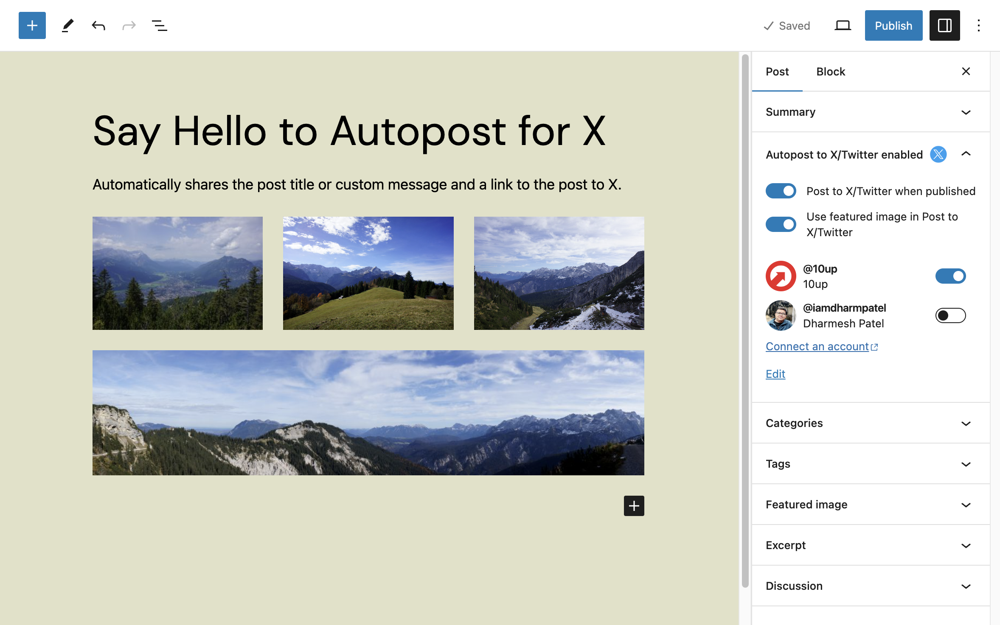
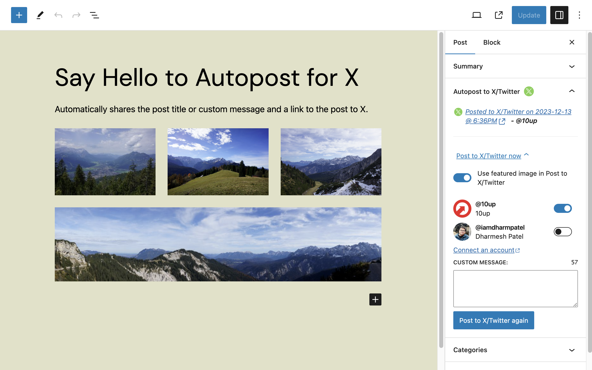

# Autopost for X (formerly Autoshare for Twitter)

> Automatically tweets the post title or custom message and a link to the post.

[](#support-level) [](https://github.com/10up/autoshare-for-twitter/releases/latest)  [](https://github.com/10up/autoshare-for-twitter/blob/develop/LICENSE.md)
[](https://github.com/10up/autoshare-for-twitter/actions/workflows/eslint.yml)
[](https://github.com/10up/autoshare-for-twitter/actions/workflows/php-compatibility.yml)
[](https://github.com/10up/autoshare-for-twitter/actions/workflows/phpcs.yml)
[](https://github.com/10up/autoshare-for-twitter/actions/workflows/phpunit.yml)
[](https://github.com/10up/autoshare-for-twitter/actions/workflows/cypress.yml)

## Overview

Autopost for X (formerly Autoshare for Twitter) automatically shares your posts to X/Twitter as soon as they’re published.  Once you hit the Publish button, the plugin sends your post’s title, featured image, and link to X/Twitter, along with a custom message.

| Create post screen with Autopost for X/Twitter options | Published post screen with Autopost for X/Twitter options. |
| -------------- | ---------------- |
| [](.wordpress-org/screenshot-1.png) | [](.wordpress-org/screenshot-2.png) |

Unlike a myriad of other social media, multitool solutions, Autopost for X is built solely for X/Twitter.  It focuses on doing one thing and does it well, with the code and interface craftsmanship we apply to every project.

With Autopost for X, developers can further customize nearly everything about the tweets, including the image, author, and link, using an extensive set of hooks built into the code. Among its other features, the WordPress plugin:

* Works in both the classic and new block editors.
* Becomes part of the pre-publish checklist step that’s part of the new block editor.
* Posts a high-quality featured image with your tweet.
* Counts characters to keep you under the tweet limit.
* Adds a link to the tweet in the block editor sidebar.

| Autopost For X/Twitter block editor sidebar panel | Autopost for X/Twitter Settings, found under `Settings` > `Autopost for X`. | 
| --------------- | --------------- |
|[](.wordpress-org/screenshot-3.gif) | [](.wordpress-org/screenshot-4.png)|

**Disclaimer:** _TWITTER, TWEET, RETWEET and the Twitter logo are trademarks of Twitter, Inc. or its affiliates._

## Requirements

- PHP 7.4+
- [WordPress](http://wordpress.org) 5.7+

## Installation

1. Install the plugin via the plugin installer, either by searching for it or uploading a .ZIP file.
2. Activate the plugin.
3. Save X/Twitter connection settings, found under `Settings` > `Autopost for X`.

## Plugin Compatibility

### Distributor

When using with 10up's [Distributor plugin](https://github.com/10up/distributor), posts that are distributed will not be autoshared if they are already tweeted from the origin site. Autopost for X tracks posts that have been tweeted in post meta to avoid "double tweeting". To avoid this behavior, use the `dt_blacklisted_meta` filter to exclude the 'autoshare_for_twitter_status' meta value from being distributed :

```php
add_filter( 'dt_blacklisted_meta', function( $blacklisted_metas ) {
	$blacklisted_metas[] = 'autoshare_for_twitter_status';
	return $blacklisted_metas;
} )
```

## Developers

**Note:** Posts and pages are supported by default. Developers can use the `autoshare_for_twitter_default_post_types` filter to change the default supported post types (for more, see #25). The plugin namespace changed to just 'autoshare' as of version 1.0.0.

Custom post types can now be opted into autopost features like so:

```php
function opt_my_cpt_into_autoshare() {
	add_post_type_support( 'my-cpt', 'autoshare-for-twitter' );
}
add_action( 'init', 'opt_my_cpt_into_autoshare' );
```

In addition, adding support while registering custom post types also works. Post types are automatically set to autoshare. Future versions of this plugin could allow this to be set manually.

While the autoshare feature can be opted into for post types using the above filter, by default the editor still has to manually enable autoshare during the post prepublish flow. The `autoshare_for_twitter_enabled_default` filter allows autoshare to be enabled by default for all posts of a given post type. Editors can still manually uncheck the option during the publishing flow.

Example:

```php
function enable_autoshare_by_default_for_core_post_type( $enabled, $post_type ) {
	if ( 'post' === $post_type ) {
		return true;
	}

	return $enabled;
}
add_filter( 'autoshare_for_twitter_enabled_default', 'enable_autoshare_by_default_for_core_post_type', 10, 2 );
```

## FAQs

### Does this plugin work with Gutenberg?

Yes, yes it does! For more details on this, see [#44](https://github.com/10up/autoshare-for-twitter/pull/44).

### Does the plugin work with X/Twitter API V2?

Yes, the plugin is compatible with X/Twitter API v2.

### I'm encountering the error message "401: Unauthorized." What could be the possible reason for this error?

There are a few potential reasons for this error:

1. **Incorrect X/Twitter API credentials**: Please ensure that you have entered the correct X/Twitter API credentials.
2. **Deprecated access levels**: If you are still using the old X/Twitter access levels (Standard (v1.1), Essential (v2), Elevated (v2), etc...), you must migrate to the new access levels (Free, Basic, Pro, etc.). Please make sure to migrate to the new access levels to ensure uninterrupted functionality. Here's how you can do it:

	1. Go to the following URL: https://developer.twitter.com/en/portal/products
	2. Look for the "Downgrade" button.
	3. Click on it to migrate to the free access level.

### I'm encountering the error message "429: Too Many Requests." What could be the possible reason for this error?

If you're seeing the error message "429: Too Many Requests" it indicates that you have exceeded the usage limits of X/Twitter's Free API access. With the Free API, you are allowed **1,500 Tweets per month** and **50 requests within a 24-hour period**. Since you have surpassed the daily limit, we kindly advise waiting for 24 hours before attempting to tweet again.

To avoid encountering this error in the future and to have higher usage limits, we recommend considering a subscription to either the Basic or Pro access level. These access levels provide increased quotas and additional benefits to accommodate your needs. For more information on X/Twitter API access levels, you can visit this link: https://developer.twitter.com/en/products/twitter-api.

## Support Level

**Stable:** 10up is not planning to develop any new features for this, but will still respond to bug reports and security concerns. We welcome PRs, but any that include new features should be small and easy to integrate and should not include breaking changes. We otherwise intend to keep this tested up to the most recent version of WordPress.

## Changelog

A complete listing of all notable changes to Autopost for X are documented in [CHANGELOG.md](https://github.com/10up/autoshare-for-twitter/blob/develop/CHANGELOG.md).

## Contributing

Please read [CODE_OF_CONDUCT.md](https://github.com/10up/autoshare-for-twitter/blob/develop/CODE_OF_CONDUCT.md) for details on our code of conduct, [CONTRIBUTING.md](https://github.com/10up/autoshare-for-twitter/blob/develop/CONTRIBUTING.md) for details on the process for submitting pull requests to us, and [CREDITS.md](https://github.com/10up/autoshare-for-twitter/blob/develop/CREDITS.md) for a listing of maintainers, contributors, and libraries for Autopost for X.

## Like what you see?

<a href="http://10up.com/contact/"></a>
